# PANDAS Autoimmune Tracker - Architecture Documentation

## 🏗️ System Architecture Overview

The PANDAS Autoimmune Tracker is built as a modern, secure, and scalable web application specifically designed for managing complex pediatric autoimmune conditions. The architecture prioritizes healthcare independence, data security, and family collaboration.

## 🎯 Design Principles

### Healthcare Independence
- **Provider Agnostic**: Works with ANY healthcare provider or system
- **No Vendor Lock-in**: Complete data portability and control
- **Universal Compatibility**: Integrates with any EHR or medical system
- **Emergency Access**: Critical information available anywhere, anytime

### Security First
- **Zero Trust Architecture**: Verify everything, trust nothing
- **Defense in Depth**: Multiple layers of security controls
- **Privacy by Design**: Privacy considerations built into every component
- **HIPAA Compliance**: Comprehensive protection for medical data

### Family Centric
- **Multi-User Collaboration**: Secure sharing among family members
- **Role-Based Access**: Appropriate permissions for different users
- **Child Privacy Protection**: Special protections for minors
- **Conflict Resolution**: Handle disagreements about data access

## 🏛️ High-Level Architecture

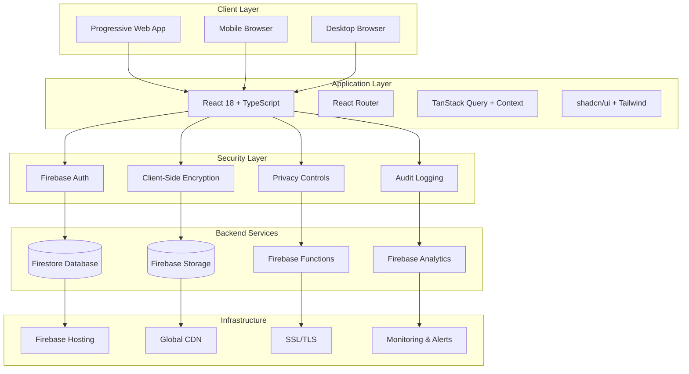

## 🔧 Technical Stack

### Frontend Technologies

#### Core Framework
- **React 18**: Latest React with concurrent features and Suspense
- **TypeScript**: Full type safety throughout the application
- **Vite**: Fast development server and optimized production builds
- **React Router DOM**: Client-side routing with lazy loading

#### UI Framework
- **shadcn/ui**: Modern component library built on Radix UI primitives
- **Tailwind CSS**: Utility-first CSS framework with custom design system
- **Lucide React**: Consistent icon library
- **next-themes**: Dark/light mode support with system preference detection

#### State Management
- **React Context**: Global state management for auth and app state
- **TanStack Query**: Server state management with caching and synchronization
- **React Hook Form**: Performant form handling with validation
- **Zod**: Runtime type validation and schema definition

#### Data Visualization
- **Recharts**: Responsive charts and data visualization
- **Custom Components**: Specialized medical data visualizations
- **Interactive Analytics**: Real-time pattern recognition displays

### Backend Services

#### Firebase Platform
- **Firebase Authentication**: Secure user management with multiple providers
- **Firestore Database**: NoSQL database with real-time synchronization
- **Firebase Storage**: Secure file storage with access controls
- **Firebase Functions**: Serverless functions for complex operations
- **Firebase Hosting**: Global CDN with automatic SSL certificates

#### Security Services
- **Client-Side Encryption**: AES-256 encryption for sensitive data
- **Key Management**: Secure cryptographic key handling
- **Session Management**: Secure session handling with automatic expiration
- **Audit Logging**: Comprehensive logging of all data access

## 🏗️ Application Architecture

### Component Architecture

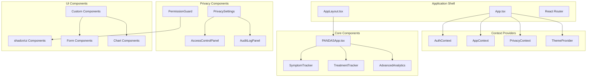

### Data Flow Architecture

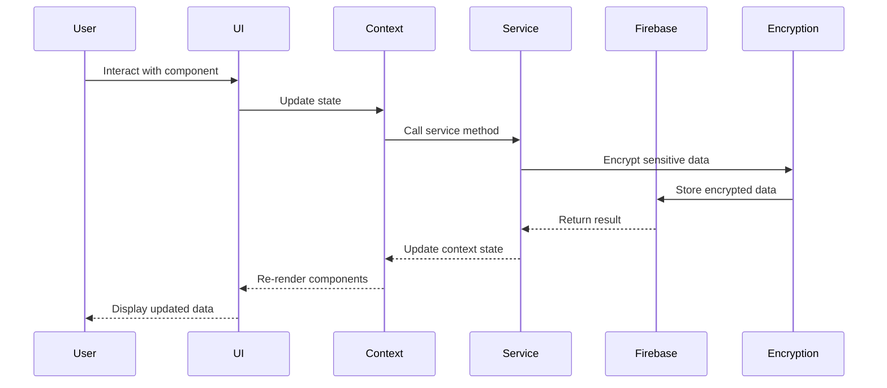

## 🔒 Security Architecture

### Authentication & Authorization

#### Multi-Layer Authentication
1. **Firebase Authentication**: Primary authentication provider
2. **Multi-Factor Authentication**: Optional 2FA for enhanced security
3. **Session Management**: Secure session handling with automatic expiration
4. **Device Fingerprinting**: Additional security for suspicious activity detection

#### Role-Based Access Control
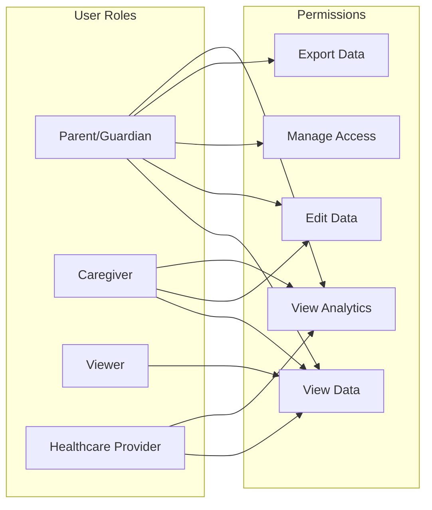

### Data Protection

#### Encryption Strategy
- **Data at Rest**: AES-256 encryption for all sensitive medical data
- **Data in Transit**: TLS 1.3 for all communications
- **Client-Side Encryption**: Sensitive data encrypted before transmission
- **Key Management**: Secure key derivation and rotation

#### Privacy Controls
- **Granular Permissions**: Fine-grained control over data access
- **Child-Specific Privacy**: Special protections for minors
- **Data Retention**: Automated deletion and retention policies
- **Consent Management**: Comprehensive consent tracking

### Audit & Compliance

#### Comprehensive Logging
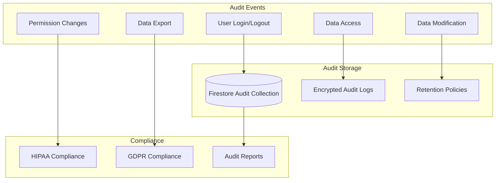

## 📊 Data Architecture

### Database Design

#### Firestore Collections Structure
```
users/
├── {userId}/
    ├── profile: UserProfile
    ├── privacy_settings: PrivacySettings
    └── children/
        ├── {childId}/
            ├── profile: ChildProfile
            ├── symptoms/
            │   └── {symptomId}: SymptomRating
            ├── treatments/
            │   └── {treatmentId}: Treatment
            ├── vitals/
            │   └── {vitalId}: VitalSigns
            ├── notes/
            │   └── {noteId}: Note
            └── files/
                └── {fileId}: FileMetadata

privacy_settings/
├── {userId}: PrivacySettings

audit_logs/
├── {logId}: AuditLog

family_access/
├── {accessId}: FamilyAccess

provider_access/
├── {accessId}: ProviderAccess
```

#### Data Relationships
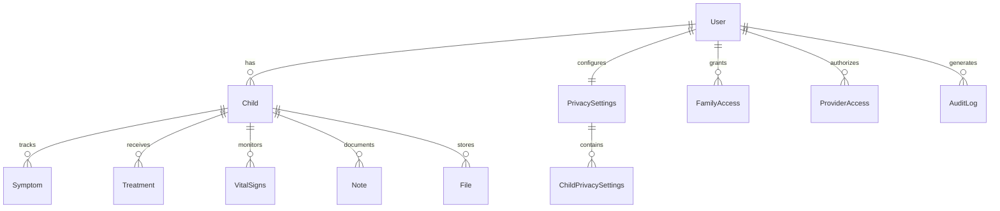

### Data Encryption Strategy

#### Encryption Layers
1. **Application Layer**: Client-side encryption for PHI
2. **Transport Layer**: TLS 1.3 for all communications
3. **Storage Layer**: Firebase encryption at rest
4. **Backup Layer**: Encrypted backups with separate keys

#### Key Management
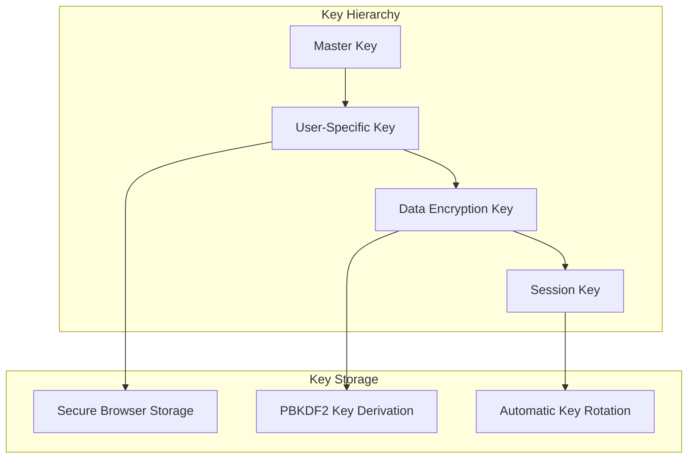

## 🌐 Network Architecture

### Content Delivery

#### Global Distribution
- **Firebase Hosting**: Global CDN with edge locations
- **Static Asset Optimization**: Compressed and cached assets
- **Progressive Loading**: Lazy loading for non-critical resources
- **Service Worker**: Offline functionality and caching

#### Performance Optimization
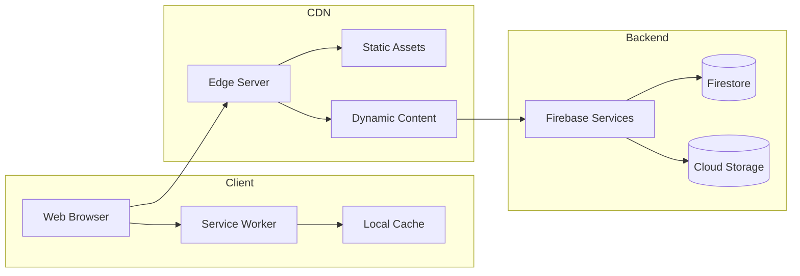

## 📱 Mobile Architecture

### Progressive Web App

#### PWA Features
- **App-like Experience**: Native app feel in the browser
- **Offline Functionality**: Core features available without internet
- **Push Notifications**: Medical reminders and alerts
- **Home Screen Installation**: Easy access from device home screen

#### Responsive Design Strategy
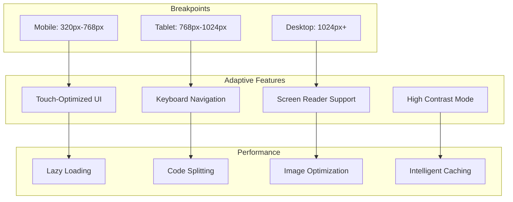

## 🔄 Integration Architecture

### Healthcare System Integration

#### Provider-Agnostic Design
- **Universal Data Formats**: Standard medical data formats
- **API Compatibility**: RESTful APIs for EHR integration
- **Magic Link System**: Secure temporary access for providers
- **Report Generation**: Professional reports in multiple formats

#### Third-Party Integrations
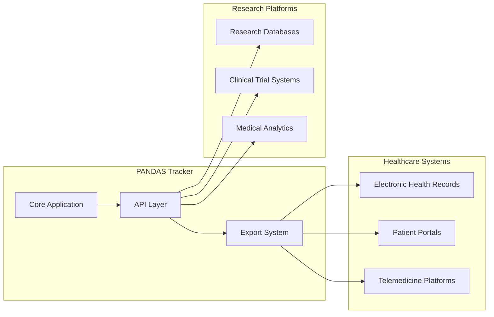

## 🚀 Deployment Architecture

### Production Environment

#### Infrastructure Components
- **Firebase Hosting**: Static site hosting with global CDN
- **Firestore**: Managed NoSQL database with automatic scaling
- **Cloud Storage**: Secure file storage with access controls
- **Cloud Functions**: Serverless compute for complex operations

#### Deployment Pipeline
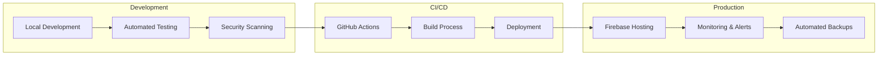

## 📊 Monitoring & Observability

### Application Monitoring

#### Key Metrics
- **Performance**: Page load times, bundle sizes, Core Web Vitals
- **Security**: Failed authentication attempts, suspicious activity
- **Usage**: Feature adoption, user engagement, error rates
- **Medical**: Data entry patterns, provider interactions, emergency access

#### Alerting Strategy
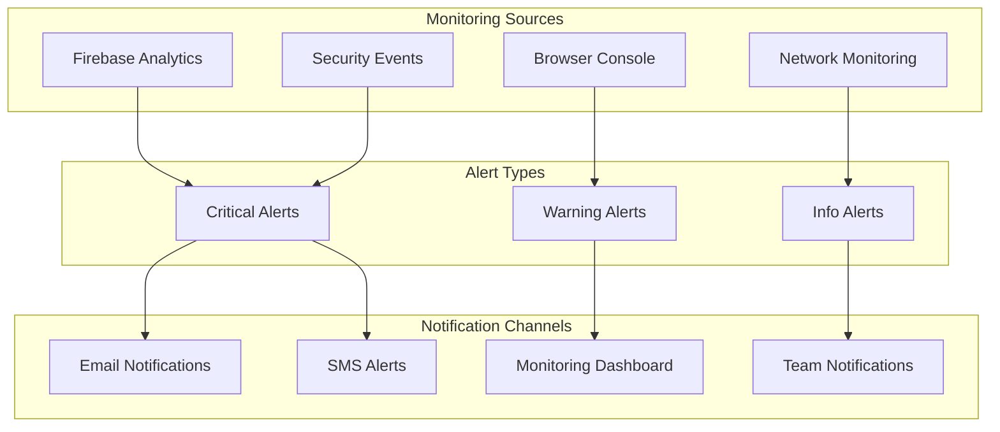

## 🔮 Future Architecture Considerations

### Scalability Planning
- **Microservices Migration**: Gradual transition to microservices architecture
- **Multi-Region Deployment**: Global deployment for reduced latency
- **Advanced Analytics**: Machine learning for pattern recognition
- **Native Mobile Apps**: iOS and Android native applications

### Technology Evolution
- **React Server Components**: Server-side rendering improvements
- **WebAssembly**: Performance-critical operations
- **Edge Computing**: Computation closer to users
- **Blockchain**: Immutable audit trails for critical medical data

---

## 📚 Related Documentation

- [Security Architecture](../security/incident-response-procedures.md)
- [Privacy Implementation](../src/lib/privacy/README.md)
- [API Documentation](../src/docs/)
- [Deployment Guide](../PANDAS_TRACKER_GUIDE.md#technical-deployment-guide)

## 🤝 Contributing to Architecture

When proposing architectural changes:
1. Consider impact on medical data security
2. Ensure HIPAA compliance is maintained
3. Evaluate performance implications
4. Consider mobile and accessibility impacts
5. Document migration strategies
6. Include security review requirements

---

*This architecture documentation is maintained by the development team and updated with each major release. For questions or suggestions, please create an issue or discussion in the GitHub repository.*